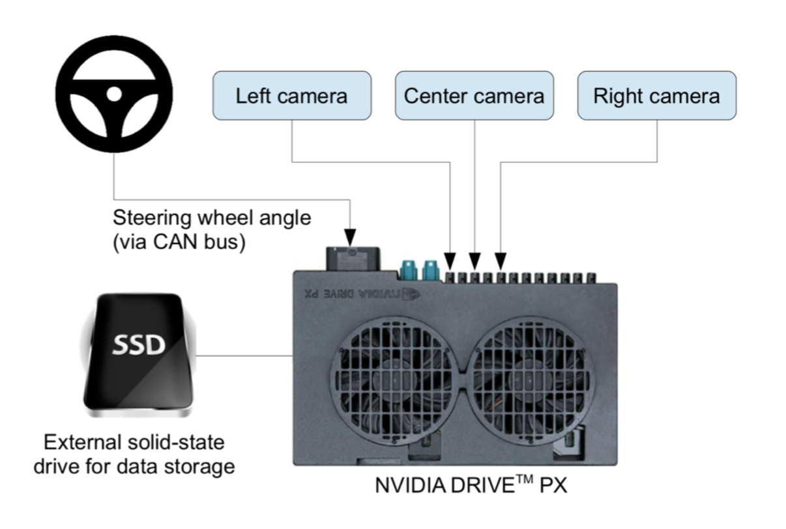

## Project Description

In this project, we use a neural network to clone car driving behavior.  It is a supervised regression problem between the car steering angles and the road images in front of a car.  

Those images were taken from three different camera angles (from the center, the left and the right of the car).  

The network is based on [The NVIDIA model](https://devblogs.nvidia.com/parallelforall/deep-learning-self-driving-cars/), which has been proven to work in this problem domain.

As image processing is involved, the model is using convolutional layers for automated feature engineering.  

### Files included

- model.py The script used to create and train the model.
- drive.py The script to drive the car. You can feel free to resubmit the original drive.py or make modifications and submit your modified version.
- utils.py The script to provide useful functionalities (i.e. image preprocessing and augumentation)
- model.h5 The model weights.
- environments.yml conda environment (Use TensorFlow without GPU)


Note: drive.py is originally from [the Udacity Behavioral Cloning project GitHub](https://github.com/udacity/CarND-Behavioral-Cloning-P3) but it has been modified.

## Quick Start

### Install required python libraries:

You need a [anaconda](https://www.continuum.io/downloads) or [miniconda](https://conda.io/miniconda.html) to use the environment setting.

```python
# Use TensorFlow without GPU
conda env create -f environment.yml 

# Use TensorFlow with GPU
conda env create -f environment-gpu.yml
```

Or you can manually install the required libraries (see the contents of the environemnt*.yml files) using pip.
The description and use of all the dependencies is provided in the [dependencies.txt](https://github.com/Pratt2309/ADS_Self_Driving_Car/blob/master/dependencies.txt) file.

### Run the pretrained model

Start up [the Udacity self-driving simulator](https://github.com/udacity/self-driving-car-sim), choose a scene and press the Autonomous Mode button.  Then, run the model as follows:

```python
python drive.py model.h5
```

### To train the model

You'll need the data folder which contains the training images.

```python
python model.py
```

This will generate a file `model-<epoch>.h5` whenever the performance in the epoch is better than the previous best.  For example, the first epoch will generate a file called `model-000.h5`.

## Data generation

Generation of data takes place during simulation. A human driver drives the car on the tracks for the first simulation to generate driving images. Three cameras are placed on the front of the vehicle to capture left, right, centre perspective frontal images as the car drives along the road. In addition to the three sets of images captured, braking, acceleration, and steering angles applied by the human driver are also obtained. We are then left with a csv file consisting of all the relevant data that will be needed to train the model. Because the model essentially learns what it is trained on — the human driver’s driving images in this case— that is why this sort of training is termed behavioural-cloning and hence, we tried to drive as neatly as possible, ensuring with didn’t once veer off the road.



## Data Pre-processing
The images that are captured contain features like the hood of the car and the sky that are inconsequential to the training and results of the model so we cropped these out. Subsequently, the images are normalized to avoid saturation and make the gradients work better. Image pre-processing measures taking:

- the images are cropped so that the model won’t be trained with the sky and the car front parts
- the images are resized to 66x200 (3 YUV channels) as per NVIDIA model
- the images are normalized (image data divided by 127.5 and subtracted 1.0). As stated in the Model Architecture section, this is to avoid saturation and make gradients work better)


## Model Architecture Design

The design of the network is based on [the NVIDIA model](https://devblogs.nvidia.com/parallelforall/deep-learning-self-driving-cars/), which has been used by NVIDIA for the end-to-end self driving test.  As such, it is well suited for the project.  

It is a deep convolution network which works well with supervised image classification / regression problems.  As the NVIDIA model is well documented, We were able to focus how to adjust the training images to produce the best result with some adjustments to the model to avoid overfitting and adding non-linearity to improve the prediction.

We've added the following adjustments to the model. 

- We used Lambda layer to normalized input images to avoid saturation and make gradients work better.
- We've added an additional dropout layer to avoid overfitting after the convolution layers.
- We've also included ELU for activation function for every layer except for the output layer to introduce non-linearity.

In the end, the model looks like as follows:

- Image normalization
- Convolution: 5x5, filter: 24, strides: 2x2, activation: ELU
- Convolution: 5x5, filter: 36, strides: 2x2, activation: ELU
- Convolution: 5x5, filter: 48, strides: 2x2, activation: ELU
- Convolution: 3x3, filter: 64, strides: 1x1, activation: ELU
- Convolution: 3x3, filter: 64, strides: 1x1, activation: ELU
- Drop out (0.5)
- Fully connected: neurons: 100, activation: ELU
- Fully connected: neurons:  50, activation: ELU
- Fully connected: neurons:  10, activation: ELU
- Fully connected: neurons:   1 (output)

As per the NVIDIA model, the convolution layers are meant to handle feature engineering and the fully connected layer for predicting the steering angle.  However, as stated in the NVIDIA document, it is not clear where to draw such a clear distinction.  Overall, the model is very functional to clone the given steering behavior.  


## Training, Validation and Test

We splitted the images into train and validation set in order to measure the performance at every epoch.  Testing was done using the simulator.

As for training, 

- We used mean squared error for the loss function to measure how close the model predicts to the given steering angle for each image.
- We used Adam optimizer for optimization with learning rate of 1.0e-4 which is smaller than the default of 1.0e-3.  The default value was too big and made the validation loss stop improving too soon.
- We used ModelCheckpoint from Keras to save the model only if the validation loss is improved which is checked for every epoch.
- We tinkered with the epoch and image sample per epoch values for training the model before concluding that a sample per epoch value of 20,000 and an epoch count of just around 8-10 provided us with the best trade-off between performance and computing time, especially as we observed that higher epochs of about 20 and above really failed to offer any improvement in the validation loss and a much longer computing time. 

### The Lake Side Track

As there can be unlimited number of images augmented, we set the samples per epoch to 20,000. This is a two-lane desolate road that has very few steep bends, and largely consists of straight roads to navigate through. The batch size of 40 was chosen as that is the maximum size which does not cause out of memory error on my Mac.

### The Jungle Track

This track was later released in the new simulator by Udacity and replaced the old mountain track. It's much more difficuilt than the lake side track and the old mountain track.A larger circuit than the lake side track, and it has a more serpentine nature, which is why it can be quite tricky to navigate without veering off road.

## Evaluation

Evaluation of the model is done in the unity simulation. As shown in figure 3, in testing (Autonomus) mode the car simulator streams in images in realtime and the network takes these images as input and provides steering commands that achieve the proposed steering angles to control the car.

## Outcome

We have been able to build, train and drive the model using data generated from many minutes of in-game driving. The CNN has also been evaluated across multiple tracks and shows, rather ostensibly, that more work is needed to improve the ability of the network to perform equally well on tracks it had not been trained on. However, the demo of the simulation shows that the model is able to navigate the course with which it was trained with impressively.

|Lake Track|Jungle Track|
|:--------:|:------------:|
|[](https://www.youtube.com/watch?v=Qds_vNUqo0g)|[](https://www.youtube.com/watch?v=-OyanWt9Rgk)|
|[YouTube Link](https://www.youtube.com/watch?v=Qds_vNUqo0g)|[YouTube Link](https://www.youtube.com/watch?v=-OyanWt9Rgk)|


## References
- NVIDIA model: https://devblogs.nvidia.com/parallelforall/deep-learning-self-driving-cars/
- Udacity Self-Driving Car Simulator: https://github.com/udacity/self-driving-car-sim
